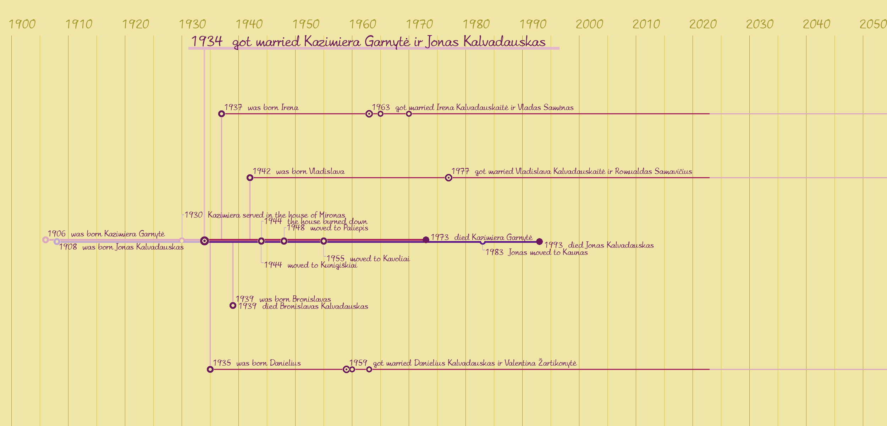
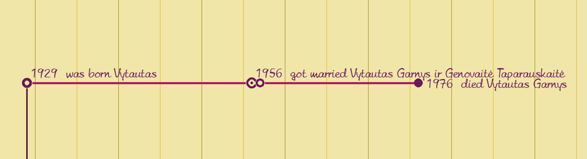
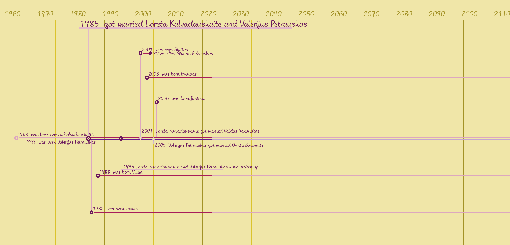

 # Family Timeline
### Video Demo:  <https://youtu.be/aQEfSBw-k9U>
### Description
#### **Introduction**
This program is my final project in Harvard university online course "CS50 Introduction to Programming with Python".  
I have been creating a family tree for the last year. I found hundreds of records of births, deaths and marriages of people with my family name. Since every family had at least one John, George, Anna or Elizabeth, it is very difficult to remember if this John is from one or another family or was this Elizabeth alive at that time. So I decided to create a program that would help me better imagine what the family situation was like at a certain time. The program creates a picture that can be saved in a file for each family and checked out if any question arises.
  

#### **Technologies and launch of program**
Program was created with Python 3.12.0

To lounch a program Pillow library is needed as well as font "Amelies.ttf".  
Data should be saved into two files: "persons.csv" and "facts.csv".

 
There are four columns in data file persons.csv:

* "id": unique code, compulsory field;
* "vardas" (first name): text, optional field;
* "pavarde" (second name): text, optional field;
* "gime" ("was born"): year (four digits), optional field. Data from this field arent't used later in the program. Date of birth helps to pick out which exact persons id, saved in the first column. This is especially useful when a person has a very common first and second name.

 
There are eight columns in data file facts.csv:

* "ivykio_id" (event_id): unique code, compulsory field;
* "asm_id" (person id): person id, corresponds one of ids from dataset "person.csv", compulsory field;
* "ivykio_tipas" (event type): integer from 01 to 04, where 01 means birth, 02 means death, 03 means marriage, 04 means other events, optional field, however if "event type" is omitted, that event will not be included into a family timeline;
* "ivykio_mastas" (event extent): integer 01 or 02, where 01 means that event is connected with person, whose id is in column "asm_id" (it can be used in case of graduating school or person death), 02 means that the event involves several family members (e.g. moving to a new place or the birth of a child), optional field, however if "event extent" is omitted, that event will not be included into a family timeline;
* "pradzia" (event started): year when event started (or occurred), optional field. However, if the family creation date is not written, the family timeline will not be created. If child birth date is omitted, the child life line will not be drawn. If event start date is omitted, the dot representing that event will not be drawn.So it is better to write an approximate date than to miss it.  
You can omit the date of birth or death of wife or husband. If wife or husband birth date is missed, her (or him) life line starts from marriage date.
* "pabaiga" (event ended): year when event ends, optional field (currently data from this field is only used to draw points indicating family divorces);
* "ivykio_asm_id" (event person id): id person whom this event is connected with (for example, child who was birth, or spouse id), optional field;
* "ivykis" (event): event description, optional field. A long description can cover another description, so it is recommended to keep the description as short as possible.

#### **Examples of use**

According given data program draws family timeline. Family timeline consists of life lines of the husband and wife, semicircles marking wife's or husband's important lifes events, circles marking important family events and life lines of children.

***Figure 1.** Full family timeline with marked events and life lines of children on it*

There are dots with explanations marking child birth, marriage and death and dots without explanations marking birth of grandchilds on the life lines of children.

***Figure 2.** Child's life line*

After running a program, you'll be promted to enter husband id. You can omit it if parent were not married and the father of children is unknown.
If only wife's Id is entered, the program will draw children's life lines and write all descriptions of family events above wife's life line only.  
The reverse option is not provided becouse I have never seen record, where would mention child's father but not his mother.

If person is still alive or the date of his death is unknown, a bright life line is drawn up to the present time and to the end of sheet is continued not sutch bright life line (figure 1). 
If family timeline starts more than 150 years ago and person's death date is unknown, bright life line is drawn up to the end of sheet.

If the couple divorces and the new family is created, it is possible to draw life lines of both families. Events that were treated as family events in a previous marriage are treated as personal events in a new family. The life lines of children's from other marriage are drawn only on their biological father's (or mother's) side of the family timeline.

***Figure 3.** Family timeline with children from another marriage*

If both parents are known, the fact of child birth should be recorded for both parents. If child's birth is saved only as life event of his father, the child will be treated as husband child from another marriage. It means that their life lines will be drawn only on the husband's side of the family timeline. And if there are more than ten child in a family, it will be difficult to distinguish the life line of one child from another.

If the person id is recorded in the data set "persons", but the first and/or second name is omitted, the family timeline will be drawn and multiple dots will be written in place of the person's first and/or second name.

***Figure 4.** Life line when first name and second name are omited*

The date of person's birth will be written on the family timeline if only it was been saved in dataset "facts". Even the parents is unknown.

At figure 5 is shown an example of record of person with id 01000100011, who was born in 1908 and which parents is unknown.

|**ivykio_id**|**asm_id**|**ivykio_tipas**|**ivykio_mastas**|**pradzia**|**pabaiga**|**ivykio_asm_id**|**ivykis**|
|:-----:|:-----:|:-----:|:-----:|:-----:|:-----:|:-----:|:-----|
|138||01|02|1908||01000100011||

***Figure 5.** An example of record in dataset "facts"*

If date of person's birth is recorded only in dataset "persons", it will be treated as unknown in the family timeline (for example, husband's life line in figure 3).

#### **Project status**

While creating the program, new ideas emerged on how it could be supplemented. 
In the future, I intend to make it possible to put the timelines of several families on one sheet. I also plan to supplement the scale of events with a third parameter, events related to the living environment. Wars, pandemics, economic crisis and similar events covering a certain period of time would not be represented by dots, but by a colored background of family timeline.

#### **Other information**
Program created by **Ina Samanavičiūtė - Grigoravičienė**. 
Have comments or suggestions? You can submit them by e-mail: i_samanaviciute@yahoo.com

